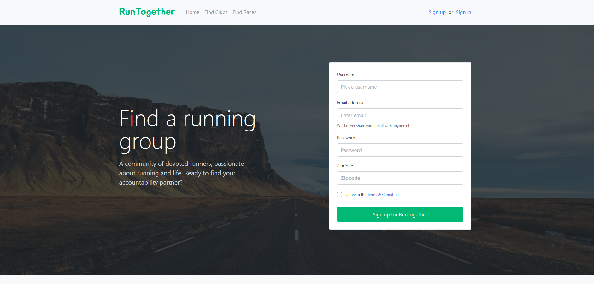
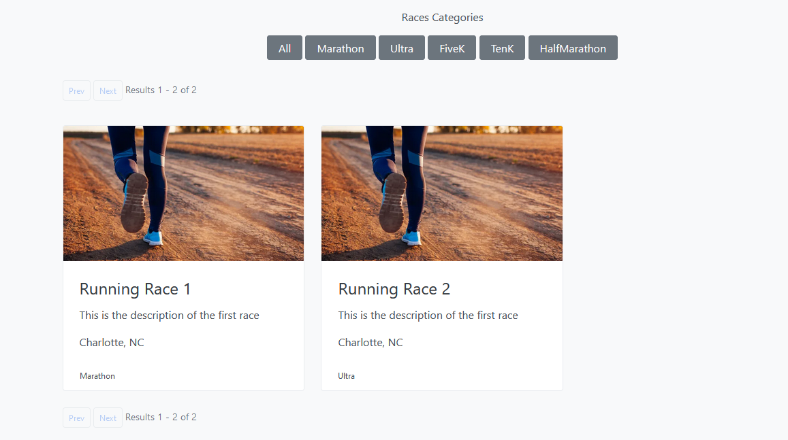
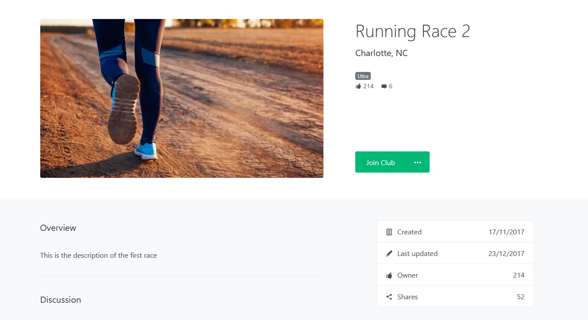
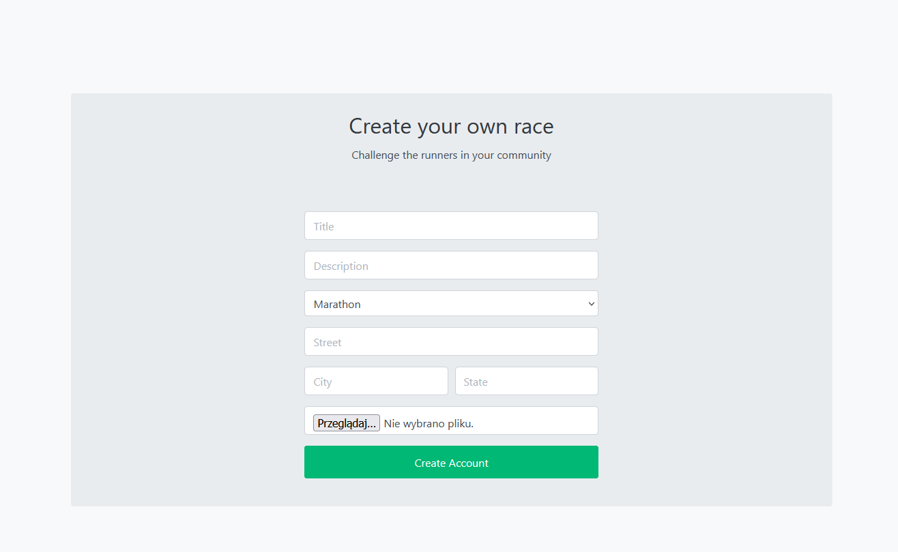
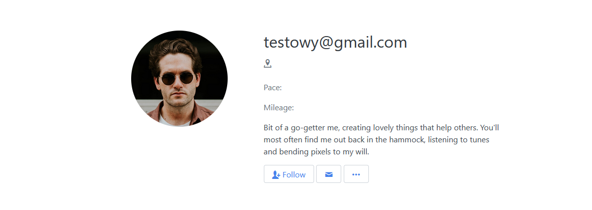
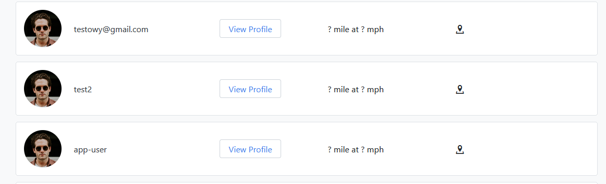

# RunTogetherWebApp

RunTogetherWebApp is a web-based platform designed to facilitate the organization and management of running races and events. The app allows users to create, edit, view, and manage race details, and provides a seamless user experience.

## Features

- **User Management**: Manage user profiles, edit personal details, and view user information.
- **Race Management**: Create, edit, and delete races. View details of individual races.
- **Club Management**: Create, edit, and delete running clubs. View details of individual clubs.
- **Responsive Design**: Optimized for various devices with custom CSS and a responsive layout.
- **Custom UI Elements**: Includes custom fonts and a range of styles (via CSS) to provide an engaging user interface.
  
## Project Structure

- **Views**: Contains Razor views (`.cshtml` files) that define the UI for various pages, including race details, user profiles, and shared layouts.
  - `Views/Race/`: Race-related pages such as index, detail, edit, and delete.
  - `Views/User/`: User-related pages like profile management.
  - `Views/Shared/`: Shared layouts and partials, including error handling and layout definitions.

- **wwwroot**: Contains static files including CSS, JavaScript, fonts, and images.
  - `wwwroot/css/`: Custom and third-party stylesheets.
  - `wwwroot/js/`: JavaScript files for interactivity and UI components.
  - `wwwroot/fonts/`: Custom fonts for the UI.
  - `wwwroot/img/`: Static images used throughout the app.

## Installation

To get started with the RunTogetherWebApp, follow these steps:

1. **Clone the repository**:
   ```bash
   git clone <repository-url>
   ```

2. **Navigate to the project directory**:
   ```bash
   cd RunTogetherWebApp
   ```

3. **Update appsettings**:
   - Update database connection string
   - Update cloudinary keys
   - Update ipinfo token

4. **Restore dependencies**:
   ```bash
   dotnet restore
   ```

5. **Update database**:
   ```bash
   dotnet ef database update
   ```

6. **Run the application**:
   ```bash
   dotnet run
   ```

## Screenshots

Below are the key screens of the application:

1. **Homepage or Dashboard**:
   - The landing page or main dashboard that users see upon logging in.
   

2. **Race Listings (Index)**:
   - Displays a list of all races. Includes filters or search functionality.
   

3. **Race Details Page**:
   - Provides detailed information about a specific race, including date, location, and participants.
   

4. **Race Creation / Edit Form**:
   - Form to create or edit a race, highlighting input fields, validation, and buttons.
   

5. **User Profile Page**:
   - Page where users can view and update their personal information.
   

6. **User List**:
   - Admin interface showing the list of all users with options for management.
   

## Technologies Used

- **ASP.NET Core**: For the backend and view rendering.
- **Razor Pages**: For dynamic HTML generation.
- **CSS**: Custom styles for a responsive and modern user interface.
- **JavaScript**: Adds interactivity and enhances the user experience.

## Contributing

Contributions are welcome! Please fork this repository and submit a pull request with your changes.

## License

This project is licensed under the MIT License. See the `LICENSE` file for more details.
